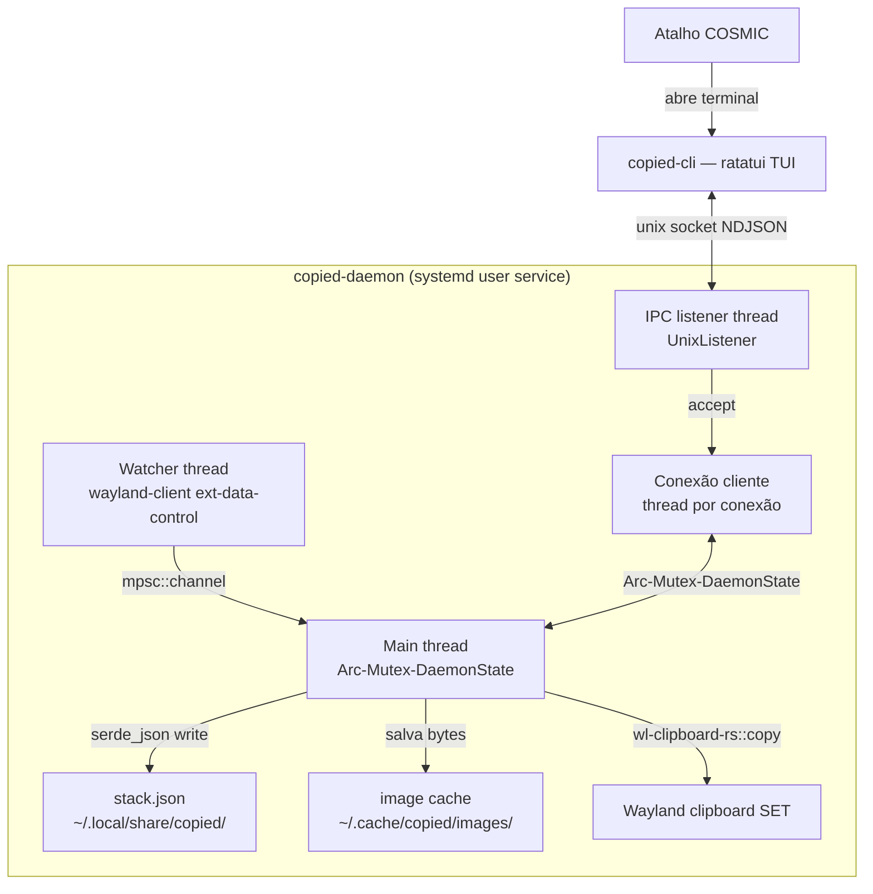

# Architecture

**Pattern:** Cliente-servidor local via IPC (Unix socket), dois binários num único workspace Cargo, sem async runtime.

## High-Level Structure

**3 threads nativas no daemon** (`crates/copied-daemon/src/main.rs`):
1. **Watcher** (`watcher.rs`) — cliente Wayland próprio escutando `zwlr_data_control_manager_v1`, emite `ClipboardChange` via `mpsc::Sender`.
2. **IPC listener** (`ipc.rs`) — `UnixListener::accept()` em loop, spawna uma thread por conexão.
3. **Main** — dona do `Arc<Mutex<DaemonState>>`, consome o `mpsc::Receiver` e persiste a cada mutação.

## Identified Patterns

### Domínio compartilhado via crate separado (`copied-core`)

**Location:** `crates/copied-core/src/lib.rs`
**Purpose:** Única fonte de verdade do protocolo IPC entre daemon e cliente — evita duplicar/dessincronizar `Command`/`Response` entre os dois binários.
**Implementation:** Enums `Command`/`Response`/`ItemKindView` com `#[serde(tag = "...")]`, tipo `ItemId = Uuid`.
**Example:** `copied_core::Command` usado tanto em `copied-daemon/src/ipc.rs:88` (parse) quanto em `copied-cli/src/ipc_client.rs:27` (serialize).

### Núcleo de domínio sem I/O, testável isoladamente

**Location:** `crates/copied-daemon/src/stack.rs`
**Purpose:** Toda lógica de LRU (15 itens), pins (5 slots), dedup por hash vive numa struct `Stack` que não toca disco/rede — 100% testável com `cargo test` puro.
**Implementation:** `Stack { items: VecDeque<Item>, pins: Vec<Item> }`; operações (`insert`, `pin`, `unpin`, `delete`, `touch`) retornam enums de resultado (`PinError`, `PushOutcome`, `UnpinOutcome`) em vez de só `bool`/`Result<(), ()>`, carregando informação suficiente pra quem chama decidir efeitos colaterais (ex: limpar cache de imagem evictada).
**Example:** `unpin()` retorna `UnpinOutcome::Unpinned { evicted: Option<Item> }` — desvio documentado do design original (`SPEC_DEVIATION` em `stack.rs:166`) porque um `bool` não bastava pra orquestrar a limpeza de imagem.

### Orquestração de efeitos colaterais na camada acima do domínio puro

**Location:** `crates/copied-daemon/src/ipc.rs` (`handle_command`), `crates/copied-daemon/src/main.rs` (`handle_clipboard_change`)
**Purpose:** `Stack` não sabe de disco; quem decide salvar/apagar imagem em cache é a camada que recebe o resultado da operação de domínio.
**Implementation:** Padrão repetido: chama método puro do `Stack` → inspeciona o enum de retorno → dispara I/O (`persistence::save_image`, `persistence::delete_image`) → chama `state.persist()`.

### Protocolo de fio simples e sincrono (NDJSON sobre Unix socket)

**Location:** `crates/copied-daemon/src/ipc.rs` (`handle_connection`), `crates/copied-cli/src/ipc_client.rs` (`IpcClient::send`)
**Purpose:** Request/response síncrono, uma linha JSON por mensagem, sem framing binário.
**Implementation:** Servidor lê linha a linha com `BufReader::lines()`; cliente escreve uma linha e bloqueia lendo a resposta com `read_line`.

### Erros logados, nunca pânico em runtime de produção

**Location:** Todo o crate `copied-daemon` (main.rs, persistence.rs, ipc.rs)
**Purpose:** Daemon de longa duração não pode morrer por falha pontual (disco cheio, arquivo corrompido, conexão perdida).
**Implementation:** `eprintln!` + fallback (pilha vazia, continuar em memória, `continue` no loop de accept) em vez de `unwrap`/`panic!`. Only 2 `.expect()` fora de testes, ambos sobre invariantes garantidos localmente (`stack.rs:109,156` — posição já encontrada por `position()` linhas antes) ou setup do processo (`main.rs:105` — `HOME` ausente é falha de ambiente irrecuperável).

## Data Flow

### Captura de clipboard → persistência

1. `watcher::run` detecta mudança de seleção Wayland, negocia MIME type, lê bytes via pipe, envia `ClipboardChange` pelo `mpsc::Sender`.
2. `main::handle_clipboard_change` recebe no loop principal, chama `stack.push_text` (texto, dedup+insert em uma operação) ou, para imagem, `stack.touch` (dedup) seguido de `persistence::save_image` + `stack.insert` se for conteúdo novo.
3. Se `insert` evictar um item (LRU), e o evictado for imagem, o arquivo de cache correspondente é removido.
4. `guard.persist()` grava o snapshot completo (`stack.json`) a cada mutação — sem batching, sem debounce.

### Comando do cliente TUI → resposta

1. `copied-cli::app` monta um `Command` (`List`/`CopyToClipboard`/`Delete`/`Pin`/`Unpin`) a partir de tecla pressionada.
2. `ipc_client::IpcClient::send` serializa, escreve linha no socket, bloqueia lendo a resposta.
3. `copied-daemon::ipc::handle_connection` desserializa, adquire lock do `DaemonState`, despacha para `handle_command`.
4. `handle_command` muta `Stack`, dispara efeitos colaterais (persist, cleanup de imagem, escrita real no clipboard via `clipboard_write`), devolve `Response`.

## Code Organization

**Approach:** Por camada técnica dentro de cada crate (não por feature) — `stack` (domínio), `persistence` (I/O disco), `ipc` (protocolo+orquestração), `watcher` (integração Wayland leitura), `clipboard_write` (integração Wayland escrita).
**Module boundaries:** `copied-core` não depende de nenhum outro crate do workspace (fundação). `copied-daemon` depende de `copied-core`. `copied-cli` depende de `copied-core`, não de `copied-daemon` (comunicação só via socket, nunca via chamada de função direta).
