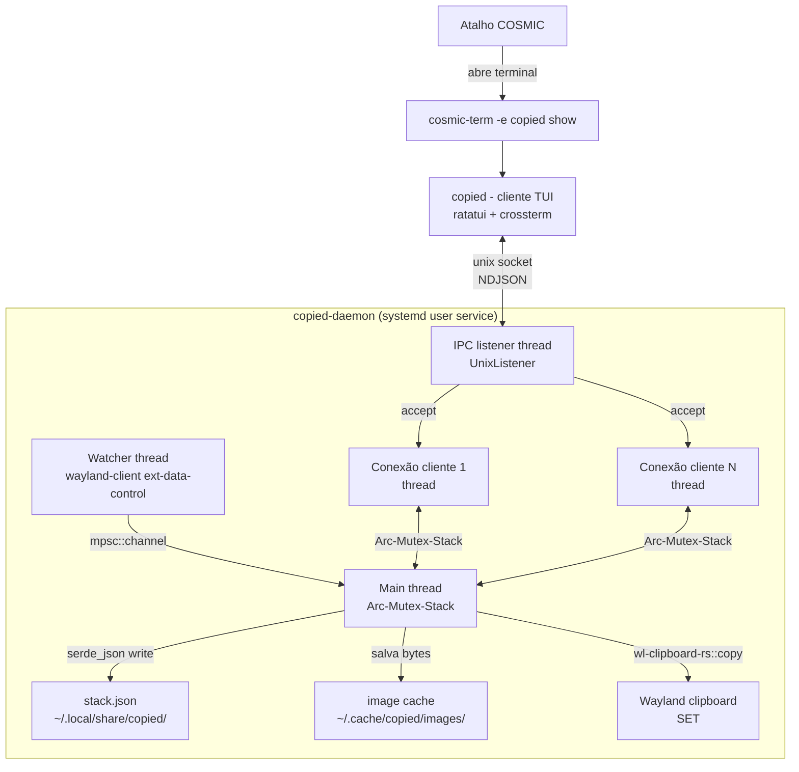

# Clipboard Manager (copied) Design

**Spec**: `.specs/features/clipboard-manager/spec.md`
**Context**: `.specs/features/clipboard-manager/context.md`
**Status**: Draft

---

## Architecture Overview

Dois binários no mesmo workspace Cargo: `copied-daemon` (background, systemd user service) e `copied` (cliente TUI, invocado sob demanda pelo atalho de teclado). Comunicam via unix domain socket em `$XDG_RUNTIME_DIR/copied.sock`, protocolo NDJSON (JSON delimitado por newline) via `serde`.

O daemon roda 3 threads nativas (`std::thread`, sem tokio — ver Tech Decisions):

1. **Watcher**: cliente Wayland próprio (protocolo `ext-data-control`/`wlr-data-control`) escutando mudanças de seleção do clipboard.
2. **IPC listener**: `UnixListener::accept()` em loop, uma thread por conexão de cliente.
3. **Main**: dona do estado (`Arc<Mutex<Stack>>`), persiste em disco a cada mutação.



---

## Code Reuse Analysis

Projeto greenfield — não há código existente no repo. "Reuso" aqui é de crates do ecossistema, não de módulos internos.

### Crates a usar

| Necessidade                          | Crate                                              | Uso                                                     |
| ------------------------------------- | --------------------------------------------------- | -------------------------------------------------------- |
| Escrever no clipboard (SET)           | `wl-clipboard-rs` 0.9.3                             | Módulo `copy` — API madura, thread de serving automática |
| Ler tipos MIME / conteúdo pontual     | `wl-clipboard-rs` 0.9.3                             | Módulo `paste` — usado só na primeira leitura após evento de mudança |
| Escutar mudanças de clipboard (watch) | `wayland-client` + protocolo `ext-data-control`/`wlr-data-control` | Implementação própria — ver referência abaixo |
| Serialização IPC e persistência       | `serde` + `serde_json`                              | Structs `Command`/`Response`/`Item` compartilhadas em crate `copied-core` |
| TUI                                   | `ratatui` 0.30.x + `crossterm` 0.29.x                | Cliente `copied` |
| Hash de conteúdo (dedup)              | `sha2` (ou `blake3`, mais rápido)                    | Hash do conteúdo pra detectar duplicata sem comparar bytes inteiros |

### Referência externa a estudar antes de implementar o watcher

`SUPERCILEX/clipboard-history` (Ringboard) — clipboard manager Rust real para Wayland/COSMIC, MIT licensed. O crate `wayland/` desse repo implementa exatamente o cliente `ext-data-control` que precisamos. **Não copiar código diretamente** (licença/atribuição à parte, o objetivo aqui é aprender) — usar como mapa de quais eventos/interfaces do protocolo lidar (`zwlr_data_control_manager_v1`, `.get_data_device()`, evento `selection`, `zwlr_data_control_offer_v1` eventos `offer`/evento final, método `receive(mime_type, fd)`).

---

## Components

### `copied-core` (crate lib, compartilhado)

- **Purpose**: Tipos de domínio e protocolo IPC compartilhados entre daemon e cliente — uma fonte de verdade pro contrato.
- **Location**: `crates/copied-core/src/`
- **Interfaces**:
  - `enum Command { List, CopyToClipboard { id: ItemId }, Delete { id: ItemId }, Pin { id: ItemId }, Unpin { id: ItemId } }`
  - `enum Response { Items(Vec<ItemView>), Ack, Error { message: String } }`
  - `struct ItemView { id: ItemId, kind: ItemKindView, pinned: bool, copied_at: SystemTime }`
- **Dependencies**: `serde`
- **Reuses**: nada (fundação)

### `copied-daemon::watcher`

- **Purpose**: Detectar mudanças no clipboard do sistema via protocolo Wayland `ext-data-control`/`wlr-data-control` e emitir eventos.
- **Location**: `crates/copied-daemon/src/watcher.rs`
- **Interfaces**:
  - `fn run(tx: mpsc::Sender<ClipboardChange>) -> !` — loop bloqueante, roda em thread dedicada
  - `enum ClipboardChange { Text(String), Image { bytes: Vec<u8>, mime: String } }`
- **Dependencies**: `wayland-client`, crate de protocolo `ext-data-control`/`wlr-data-control` (bindings gerados via `wayland-scanner` — confirmar crate exato na task de implementação, ver Open Questions)
- **Reuses**: protocolo estudado via referência Ringboard (ver acima)

### `copied-daemon::stack`

- **Purpose**: Lógica pura da pilha — 15 slots LRU + 5 pins, dedup por hash, sem I/O.
- **Location**: `crates/copied-daemon/src/stack.rs`
- **Interfaces**:
  - `struct Stack { items: VecDeque<Item>, pins: Vec<Item> }`
  - `impl Stack { fn push(&mut self, content: ClipboardChange) -> PushOutcome; fn delete(&mut self, id: ItemId) -> bool; fn pin(&mut self, id: ItemId) -> Result<(), PinError>; fn unpin(&mut self, id: ItemId) -> bool }`
  - `enum PinError { LimitReached }`
- **Dependencies**: `sha2` (hash de dedup)
- **Reuses**: nenhum I/O — testável isoladamente sem mocks (integração real de threads/socket fica pra outra camada)

### `copied-daemon::persistence`

- **Purpose**: Serializar/desserializar `Stack` em disco (JSON) e gerenciar arquivos de imagem no cache.
- **Location**: `crates/copied-daemon/src/persistence.rs`
- **Interfaces**:
  - `fn load(path: &Path) -> Stack` — retorna `Stack` vazio se arquivo ausente/corrompido (loga erro, não crasha — spec CLIP-02)
  - `fn save(path: &Path, stack: &Stack) -> io::Result<()>`
  - `fn save_image(cache_dir: &Path, bytes: &[u8], mime: &str) -> io::Result<PathBuf>` — nome do arquivo é hash do conteúdo
  - `fn delete_image(path: &Path) -> io::Result<()>`
- **Dependencies**: `serde_json`, `sha2`
- **Reuses**: hash já calculado pelo `stack` (dedup) reaproveitado como nome de arquivo — evita duplicar cálculo

### `copied-daemon::ipc`

- **Purpose**: Servidor unix socket — aceita conexões, decodifica `Command`, aplica no `Arc<Mutex<Stack>>`, responde `Response`.
- **Location**: `crates/copied-daemon/src/ipc.rs`
- **Interfaces**:
  - `fn serve(socket_path: &Path, state: Arc<Mutex<DaemonState>>) -> io::Result<()>`
- **Dependencies**: `std::os::unix::net`, `serde_json` (NDJSON framing)
- **Reuses**: `copied-core::{Command, Response}`

### `copied` (cliente TUI)

- **Purpose**: Conecta ao daemon, renderiza a pilha, captura teclas, envia comandos.
- **Location**: `crates/copied-cli/src/`
- **Interfaces**:
  - `struct App { items: Vec<ItemView>, selected: usize, exit: bool, status_message: Option<String> }`
  - `impl App { fn run(&mut self, terminal: &mut DefaultTerminal, client: &mut IpcClient) -> io::Result<()> }`
  - `struct IpcClient { fn send(&mut self, cmd: Command) -> io::Result<Response> }`
- **Dependencies**: `ratatui`, `crossterm`, `copied-core`
- **Reuses**: `copied-core::{Command, Response, ItemView}` — nenhuma lógica de negócio duplicada, TUI é pura apresentação + envio de comandos

---

## Data Models

### `Item` (interno ao daemon, não serializado pro cliente diretamente)

```rust
struct Item {
    id: ItemId,           // Uuid
    kind: ItemKind,
    content_hash: [u8; 32], // sha256, usado pra dedup
    copied_at: SystemTime,
}

enum ItemKind {
    Text(String),
    Image { path: PathBuf, mime: String, size_bytes: u64 },
}
```

### `ItemView` (serializado, o que o cliente TUI recebe)

```rust
struct ItemView {
    id: ItemId,
    kind: ItemKindView,   // Text(String) com preview truncado, ou Image { mime, size_bytes }
    pinned: bool,
    copied_at: SystemTime,
}
```

**Relacionamentos**: `Stack` possui `VecDeque<Item>` (não-pinados, 15 max, ordem = recência) e `Vec<Item>` (pins, 5 max, ordem = quando foi pinado). `ItemView` é a projeção que trafega no IPC — nunca envia bytes de imagem inteiros, só metadata (path fica só no lado do daemon; ao "copiar" imagem, o daemon lê o arquivo e chama `wl-clipboard-rs::copy` diretamente, sem passar bytes pelo socket).

---

## Error Handling Strategy

| Cenário                                                   | Tratamento                                                                 | Impacto no usuário                                  |
| ----------------------------------------------------------- | ----------------------------------------------------------------------------- | ------------------------------------------------------ |
| Daemon inicia sem `COSMIC_DATA_CONTROL_ENABLED=1`            | Watcher falha ao conectar no protocolo; loga erro claro e encerra o processo | Serviço fica `failed` no systemd — usuário vê no `status` |
| `stack.json` corrompido/ilegível                            | `persistence::load` loga erro, retorna `Stack::default()` (vazio)            | Pilha reseta silenciosamente (spec CLIP-02 edge case)   |
| Disco cheio / sem permissão de escrita                       | `save` retorna `Err`; daemon loga e continua operando só em memória          | Mudanças não persistem até o problema ser resolvido, mas app não trava |
| Cliente TUI conecta e daemon não está rodando (socket ausente) | `IpcClient::connect` falha; TUI mostra mensagem e encerra                    | "daemon não encontrado — inicie o serviço" (spec CLIP-03) |
| Conteúdo do clipboard não é texto UTF-8 nem PNG/JPEG          | Watcher ignora o evento, não emite `ClipboardChange`                         | Nada aparece na pilha — comportamento silencioso esperado |
| 6º pin tentado com 5 já ocupados                              | `Stack::pin` retorna `PinError::LimitReached`                                | TUI mostra "Máximo de 5 pins atingido"                 |
| Conexão Wayland cai (compositor reiniciou)                    | Watcher tenta reconectar com backoff (ex: 1s, 2s, 5s, cap 30s)               | Captura pausa temporariamente, sem crashar o daemon     |

---

## Tech Decisions (só as não-óbvias)

| Decisão                                    | Escolha                                                              | Rationale |
| -------------------------------------------- | ------------------------------------------------------------------- | --------- |
| Watch de clipboard                           | Cliente `wayland-client` próprio, não `wl-clipboard-rs`               | `wl-clipboard-rs` não tem módulo `watch` publicado (só PR #83 aberta) — descoberto na pesquisa técnica desta fase, corrige decisão da entrevista |
| SET do clipboard (copiar de volta)           | `wl-clipboard-rs::copy`                                              | API madura, thread de serving já resolvida — não vale reimplementar |
| Runtime assíncrono                           | Nenhum (threads `std` + `mpsc`), sem tokio                            | Watcher é loop bloqueante infinito (não se encaixa em `spawn_blocking`, que é pra tarefas finitas); tráfego IPC é esporádico, não justifica runtime async |
| Protocolo de mensagem IPC                    | NDJSON via `serde_json`                                              | Auto-descritivo, debugável manualmente (`nc`/`socat`), overhead irrelevante no volume de comandos esporádicos |
| Localização do socket                        | `$XDG_RUNTIME_DIR/copied.sock`                                        | Convenção padrão Linux pra sockets de sessão (efêmero, permissões corretas por padrão, limpo automaticamente pelo systemd/pam no logout) |
| Concorrência do IPC                          | Uma thread por conexão + `Arc<Mutex<Stack>>`                           | Volume baixíssimo de conexões simultâneas (cliente TUI é invocado sob demanda) — pool de threads seria over-engineering |
| systemd target                               | `graphical-session.target` (não `default.target`)                     | `default.target` também é atingido em boots não-gráficos; `graphical-session.target` é o padrão correto pra serviços que dependem da sessão Wayland, confirmado no próprio `cosmic-session.target` |
| Hash de dedup                                | `sha2` (SHA-256)                                                      | Simples, biblioteca padrão de fato no ecossistema Rust; volume de dados (textos curtos, poucas imagens) não justifica algo mais rápido como blake3 |

---

## Instalação / Setup (não é código, mas é pré-requisito de arquitetura)

1. `sudo sh -c 'echo "export COSMIC_DATA_CONTROL_ENABLED=1" > /etc/profile.d/copied-clipboard.sh; chmod 644 /etc/profile.d/copied-clipboard.sh'` + reboot (a env var precisa existir **antes** do compositor COSMIC iniciar — não é algo que a unit systemd do daemon possa setar sozinha)
2. `systemctl --user enable --now copied-daemon.service`
3. Configurar atalho em COSMIC Settings > Keyboard > Custom Shortcuts, comando: `cosmic-term -e copied show` (ou terminal preferido do usuário)

Unit file (`~/.config/systemd/user/copied-daemon.service`):

```ini
[Unit]
Description=Copied clipboard manager daemon
After=graphical-session.target
BindsTo=graphical-session.target

[Service]
Type=simple
ExecStart=%h/.cargo/bin/copied-daemon
Restart=on-failure
RestartSec=1

[Install]
WantedBy=graphical-session.target
```

---

## Open Questions (verificar na fase de implementação)

- **Crate exata pros bindings do protocolo `ext-data-control-v1`/`wlr-data-control-unstable-v1`**: pesquisa não confirmou o nome exato do crate Rust com os bindings gerados (candidatos: `wayland-protocols-wlr`, `wayland-protocols-misc`, ou gerar via `wayland-scanner` a partir do XML diretamente no `build.rs`, como o Ringboard provavelmente faz). Resolver isso é o primeiro passo da task de implementação do `watcher`.
- **MSRV do `wl-clipboard-rs`**: não declarado formalmente pela crate; tratar como "toolchain estável recente" e fixar a versão do Rust no `rust-toolchain.toml` do projeto assim que decidida.
