# copied-gui Design

**Spec**: `.specs/features/copied-gui/spec.md`
**Status**: Draft

---

## Architecture Overview

`copied-gui` é um novo binário (`copied`) que substitui `copied-cli`. Internamente, uma thread nativa dedicada (`ipc_worker`) possui o `IpcClient` bloqueante existente (reaproveitado sem mudança de protocolo de fio) e conversa com o daemon exatamente como hoje. As respostas chegam ao loop reativo do `iced` via um canal (`futures::channel::mpsc`) plugado como `Subscription` — o mesmo padrão arquitetural que `copied-daemon` já usa entre `watcher` e a thread principal (`mpsc::Sender`/`Receiver`), agora replicado no cliente. Nenhum código próprio do crate escreve `async`/`await`: o `iced` gerencia seu próprio executor internamente (inevitável, é parte do framework), mas a lógica de negócio do `copied-gui` continua 100% síncrona/thread-based, na mesma linha da convenção "sem async runtime" já documentada em `STACK.md` (que era escopada ao daemon, mas fica honrada por consistência no cliente também).

Um mecanismo separado (`instance_lock`) resolve o toggle: um lock file com PID em `$XDG_RUNTIME_DIR` detecta se já existe um `copied-gui` rodando; se sim, envia um sinal Unix pra ele se fechar e o processo novo encerra sem abrir janela.

```mermaid
graph TD
    KB["Atalho COSMIC"] -->|spawna processo| MAIN["copied-gui::main"]
    MAIN -->|checa lock file| LOCK["instance_lock<br/>$XDG_RUNTIME_DIR/copied-gui.pid"]
    LOCK -->|já rodando: sinal + exit| MAIN
    MAIN -->|primeira instância| APP["iced::application<br/>AppState/update/view/subscription"]
    APP -->|Command via std::sync::mpsc| WORKER["ipc_worker thread<br/>IpcClient bloqueante (reaproveitado)"]
    WORKER -->|NDJSON via Unix socket| DAEMON["copied-daemon (inalterado no protocolo,<br/>+ GetImageBytes/SetCategory)"]
    WORKER -->|Response via futures::channel::mpsc| SUB["Subscription"] --> APP
    APP -->|janela overlay| LAYER["iced_layershell<br/>zwlr_layer_shell_v1"]
    APP -->|símbolo selecionado: escreve direto| WL["wl-clipboard-rs<br/>(sem passar pelo daemon)"]
```



---

## Code Reuse Analysis

### Existing Components to Leverage

| Component | Location | How to Use |
| --- | --- | --- |
| `IpcClient` (send/recv NDJSON bloqueante) | `crates/copied-cli/src/ipc_client.rs` | Mover pra `crates/copied-gui/src/ipc_client.rs` sem alterar o protocolo de fio; passa a ser chamado de dentro da thread `ipc_worker` em vez de direto do loop de eventos. |
| Padrão thread + `mpsc::channel` | `crates/copied-daemon/src/main.rs`, `watcher.rs` | Replicado como `ipc_worker.rs`: uma thread bloqueante produz eventos, um canal os entrega ao loop reativo (aqui, uma `Subscription` do iced em vez do `main` loop do daemon). |
| `wl-clipboard-rs` (escrita direta no clipboard) | `crates/copied-daemon/src/clipboard_write.rs` | Reaproveitado diretamente em `copied-gui` pra escrever símbolos selecionados sem passar pelo daemon (decisão da entrevista). |
| `Response::Error` + `not_found()` | `crates/copied-daemon/src/ipc.rs` | Estende o mesmo padrão pros novos comandos (`GetImageBytes`, `SetCategory`): erro explícito em vez de `Option`/`bool`. |
| `Result<(), Error>` explícito (`PinError`, `UnpinOutcome`) | `crates/copied-daemon/src/stack.rs` | `Stack::set_category` segue a mesma forma: `Result<(), CategoryError>` (`CategoryError::NotFound`), não `bool`. |

### Integration Points

| System | Integration Method |
| --- | --- |
| `copied-daemon` (socket IPC) | Protocolo estendido (não substituído): `Command`/`Response` ganham variantes novas em `copied-core`; wire format (NDJSON) inalterado. |
| Compositor Wayland (COSMIC) | Janela via `zwlr_layer_shell_v1` (`iced_layershell`) em vez de terminal; clipboard write direto via `wl-clipboard-rs` só pro caso dos símbolos. |
| `CONCERNS.md` — `socket_path()` duplicada | Resolvida nesta migração: movida pra `copied-core::socket_path()`, usada por `copied-daemon` e `copied-gui` — payoff natural já que estamos criando o terceiro ponto que precisaria duplicar de novo. |

---

## Components

### `copied-core` — extensão de protocolo

- **Purpose**: Adicionar ao contrato IPC compartilhado os comandos necessários pra preview de imagem e categoria, sem quebrar compatibilidade com o que já existe.
- **Location**: `crates/copied-core/src/lib.rs`
- **Interfaces**:
  - `Command::GetImageBytes { id: ItemId }`
  - `Command::SetCategory { id: ItemId, category: Category }`
  - `Response::ImageBytes { mime: String, data_base64: String }`
  - `enum Category { Texto, Url, Codigo, Imagem, Outro }` — fieldless, `#[serde(tag = "value")]` seguindo a convenção já usada em `ItemKindView`
  - `ItemView` ganha campo `category: Category`
  - `pub fn socket_path() -> io::Result<PathBuf>` (movida de `copied-daemon::ipc` e `copied-cli::ipc_client`, ambas passam a importar daqui)
- **Dependencies**: nenhuma nova (o payload de imagem trafega como `String` já codificado em base64 — a codificação/decodificação acontece em `copied-daemon`/`copied-gui`, não aqui)
- **Reuses**: padrão `#[serde(tag = "...")]` já estabelecido pra todo enum que cruza o socket.

### `copied-daemon` — detecção de categoria + novos handlers

- **Purpose**: Computar `Category` automaticamente na captura, persistir com migração segura, e servir os dois comandos novos.
- **Location**:
  - `crates/copied-daemon/src/stack.rs` — campo `category: Category` em `Item`; `Stack::set_category(&mut self, id: ItemId, category: Category) -> Result<(), CategoryError>`
  - `crates/copied-daemon/src/categorize.rs` (novo arquivo) — `pub fn detect(text: &str) -> Category`, heurísticas simples (regex/`starts_with` pra URL, heurística leve pra código)
  - `crates/copied-daemon/src/ipc.rs` — `handle_command` ganha os dois novos braços (`GetImageBytes` lê bytes via `std::fs::read(path)` + codifica base64; `SetCategory` chama `Stack::set_category`)
  - `crates/copied-daemon/src/persistence.rs` — `Item.category` com `#[serde(default)]` pra ler `stack.json` antigo sem o campo
  - `crates/copied-daemon/src/main.rs::handle_clipboard_change` — chama `categorize::detect` ao criar `Item::new_text`; imagens recebem `Category::Imagem` direto
- **Interfaces**: ver acima.
- **Dependencies**: `base64` (novo, só pra encode/decode do payload de imagem)
- **Reuses**: padrão `Result<(), Error>` explícito de `pin`/`unpin`; padrão de log `eprintln!("copied-daemon: ...")` em erro de leitura de arquivo.

### `copied-gui` — crate novo (substitui `copied-cli`)

- **Purpose**: Janela gráfica overlay que cobre 100% do que o TUI fazia hoje, mais busca/mouse/preview/categoria/símbolos.
- **Location**: `crates/copied-gui/` (novo membro do workspace)
- **Submódulos e Interfaces**:
  - `main.rs` — bootstrap: checa `instance_lock`, monta `LayerShellSettings` (`anchor`, `size`, `exclusive_zone: 0`, `KeyboardInteractivity::OnDemand`), chama `iced_layershell::application(...).settings(...).run()`.
  - `instance_lock.rs` — `pub fn acquire_or_signal_existing() -> LockOutcome` (`LockOutcome::Acquired(LockGuard)` ou `LockOutcome::SignaledExisting`); lock file `$XDG_RUNTIME_DIR/copied-gui.pid`, checa se o PID gravado ainda está vivo (tolera lock file órfão de um crash) antes de decidir sinalizar vs assumir.
  - `app.rs` — `AppState` (items, filtro de busca, tab ativa, seleção, cache de `image::Handle` por `ItemId`, status/erro), `enum Message`, `fn update(state, message) -> Task<Message>`, `fn view(state) -> Element<Message>`, `fn subscription(state) -> Subscription<Message>` (conecta o `Receiver` do `ipc_worker`).
  - `ipc_worker.rs` — `pub fn spawn() -> (Sender<Command>, Receiver<Response>)`: thread que possui o `IpcClient`, consome `std::sync::mpsc::Receiver<Command>` bloqueante, produz respostas num `futures::channel::mpsc::UnboundedSender<Response>` (send síncrono de dentro da thread nativa, consumido pela `Subscription`).
  - `ipc_client.rs` — movido de `copied-cli`, inalterado (`IpcClient::connect`/`send`), agora usando `copied_core::socket_path()`.
  - `symbols.rs` — catálogo estático (`pub const CATALOG: &[SymbolGroup]`), sem I/O.
- **Dependencies**: `iced` (~0.14), `iced_layershell` (~0.18 — **verificar versão exata compatível com iced 0.14 no momento de editar o `Cargo.toml`**, ver Open Questions), `copied-core`, `wl-clipboard-rs` (reuso direto), `base64`, um crate pra sinal Unix (`signal-hook` ou equivalente — **nome/versão a confirmar na implementação**).
- **Reuses**: `IpcClient` inalterado; padrão thread+canal do daemon; `wl-clipboard-rs` já usado por `clipboard_write.rs`.

---

## Data Models

### `Category` (novo, `copied-core`)

```rust
#[derive(Debug, Clone, Copy, PartialEq, Eq, Serialize, Deserialize)]
#[serde(tag = "value")]
pub enum Category {
    Texto,
    Url,
    Codigo,
    Imagem,
    #[serde(other)]
    Outro,
}
```

**Relationships**: um `Category` por `ItemView`/`Item` — campo único, não lista (decisão da entrevista). `#[serde(other)]` em `Outro` garante que qualquer variante desconhecida (ex: adicionada em versão futura, ou ausente por `#[serde(default)]` no lado do domínio) cai em `Outro` em vez de falhar a deserialização.

### `ItemView` (estendido)

Ganha `pub category: Category` — sem quebrar compatibilidade de protocolo em si (é uma adição de campo; como não há versionamento de protocolo hoje, cliente e daemon são sempre implantados juntos, então não há preocupação de compatibilidade cruzada de versões).

### `Item` (estendido, `copied-daemon::stack`)

Ganha `category: Category` com `#[serde(default)]` na leitura — necessário pra `stack.json` gravado antes desta feature carregar sem erro (`persistence::load` já trata JSON incompatível como pilha vazia; aqui queremos o caso mais brando: campo ausente vira default, não descarta a pilha inteira).

### `AppState` (client-only, `copied-gui::app`, não serializado)

```rust
struct AppState {
    items: Vec<ItemView>,
    search: String,
    active_tab: Tab, // Stack | Symbols
    selected: Option<ItemId>,
    image_cache: HashMap<ItemId, iced::widget::image::Handle>,
    status: Option<String>,
    ipc_tx: std::sync::mpsc::Sender<Command>,
}
```

---

## Error Handling Strategy

| Error Scenario | Handling | User Impact |
| --- | --- | --- |
| Daemon não responde / socket ausente na conexão inicial do `ipc_worker` | Worker envia uma `Response`/mensagem interna de erro pela `Subscription`; `AppState.status` é setado | Janela abre mostrando erro ("daemon não está rodando"), sem travar; usuário fecha com Esc e inicia o daemon manualmente |
| `Command::GetImageBytes` retorna `Response::Error` (arquivo de cache ausente) | Cliente mantém o fallback textual `[Imagem MIME, KB]` pro item, não remove da lista | Miniatura não aparece pra aquele item específico; resto da UI funciona normalmente |
| Bytes de imagem recebidos não decodificam (arquivo corrompido) | `iced::widget::image::Handle::from_bytes` falha silenciosamente na renderização do widget `image` — cliente detecta antes de inserir no `image_cache` (tenta decodificar via crate de imagem antes de cachear) e usa o mesmo fallback textual, loga via `eprintln!("copied-gui: ...")` | Igual ao caso acima; sem crash |
| `stack.json` antigo sem campo `category` | `#[serde(default)]` no `Item.category` (`Category::default() = Outro`, precisa `impl Default for Category`) | Itens antigos aparecem como categoria "Outro" até serem recategorizados manualmente ou recapturados |
| Lock file de instância órfão (processo anterior crashou sem limpar) | `instance_lock` checa se o PID gravado ainda existe (`kill(pid, 0)`) antes de decidir sinalizar; se morto, assume o lock como se fosse a primeira instância | Popup abre normalmente, sem ficar "preso" achando que já existe uma instância |
| `Command::SetCategory` com `id` inexistente (item deletado entre seleção e ação) | `Stack::set_category` retorna `Err(CategoryError::NotFound)` → `Response::Error` (mesmo padrão de `PinError::NotFound`) | Mensagem de erro visível na janela, lista permanece consistente |

---

## Tech Decisions (only non-obvious ones)

| Decision | Choice | Rationale |
| --- | --- | --- |
| Ponte entre IPC bloqueante e loop reativo do iced | Thread nativa (`ipc_worker`) + canal, exposta ao iced como `Subscription` | Honra a convenção já estabelecida no projeto ("threads nativas, sem async runtime") mesmo sendo código só do cliente; evita reescrever `IpcClient` em async e evita decisões de feature-flag de executor do iced. |
| Transporte de bytes de imagem no protocolo | `String` já em base64 (`data_base64`), não `Vec<u8>` cru | `serde_json` serializa `Vec<u8>` como array JSON de números (ex: `[137,80,78,...]`), várias vezes maior que base64 pro mesmo conteúdo — desperdício real dado que é NDJSON sobre socket local. |
| Instância única (toggle) | Lock file com PID em `$XDG_RUNTIME_DIR/copied-gui.pid` + sinal Unix pro processo existente se fechar | Não existe mecanismo de instância única hoje (cada terminal do TUI era independente); resolver isso só no cliente evita tocar `copied-daemon`/protocolo pra um comportamento que é puramente de apresentação. |
| Representação de `Category` no protocolo | Enum fechado (`Texto/Url/Codigo/Imagem/Outro`) com `#[serde(tag = "value")]` | Consistência com a convenção já documentada (`CONVENTIONS.md`): todo enum que cruza o socket IPC usa tag explícita, como `Command`/`Response`/`ItemKindView`. |
| `socket_path()` consolidada | Movida pra `copied-core`, usada por `copied-daemon` e `copied-gui` | Tech debt já flagado em `CONCERNS.md`; criar `copied-gui` seria o terceiro lugar a duplicar a mesma lógica — momento natural e barato de resolver. |
| Keyboard interactivity da layer-shell surface | `KeyboardInteractivity::OnDemand` | Popup precisa capturar teclado pra busca/navegação, mas não deve roubar foco de teclado globalmente (`Exclusive`) nem ficar sem conseguir receber digitação (`None`). |

---

## Open Questions (verificar na implementação, não travadas por decisão do usuário)

- Versão exata do `iced_layershell` compatível com `iced 0.14` — indícios (crates.io) apontam para a série `0.18.x`, mas confirmar no momento de editar `Cargo.toml`/gerar `Cargo.lock`.
- API exata de "perda de foco" do `iced_layershell` pra fechar a janela (spec GUI-01 AC5) — a documentação consultada cobriu abertura/anchors/keyboard interactivity, mas não detalhou um evento explícito de "unfocused". Verificar exemplos do próprio crate (`iced_layershell` no GitHub) na hora de implementar; se não existir evento dedicado, Esc permanece o fechamento garantido e focus-loss pode ficar como best-effort (ex: via `Event::Window` genérico do iced, se emitido pelo backend layer-shell).
- Nome/crate exato pra lidar com sinal Unix em `instance_lock.rs` (`signal-hook` é a escolha mais comum no ecossistema Rust pra isso, mas não foi verificado via `find-docs` nesta sessão).

---

## Agent's Discretion (herdado de `context.md`, aplicado aqui)

- Posicionamento exato do overlay (`anchor`), transparência, dimensões da janela, tema de cores — mantido como parâmetro ajustável em `LayerShellSettings`, sem valor final travado neste design.
- Heurísticas exatas de `categorize::detect` (quais padrões contam como URL/Código).
- Catálogo exato e agrupamento de `symbols::CATALOG`.
