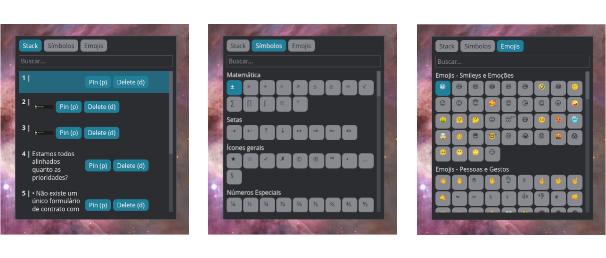

<p align="center">
  <a href="README.md">🇧🇷 Português</a> ·
  <a href="README.en.md">🇺🇸 English</a>
</p>

# copied

Clipboard history manager for **Pop!_OS 24.04 (COSMIC) / Wayland**. Runs as a background daemon, keeps the last copied items (text and images), lets you pin favorites, auto-categorizes content, and opens a quick popup to search/paste back — no terminal, triggered by a keyboard shortcut.

I created this application to train my AI-assisted development flow and at the same time start studying Rust since I always enjoyed learning by unraveling real applications, so I thought, I will exercise language agnostic architecture and Rust in something functional. I looked for something that would help in my daily life and so I remembered that I am annoying and had not found a manager that would allow me to have more features and it hurts me to admit it more similar to Windows. It is under construction and has some gaps but I will try to update it (CLT does it in my spare time). 



## What it does

- **History** of the last 15 copied items (text or image), deduplicated by hash.
- **Pins**: up to 5 pinned items that are never evicted by LRU.
- **Automatic categorization** of copied content (heuristic over the text).
- **Undecorated popup** (layer-shell, `zwlr_layer_shell_v1`) — opens on top of everything, no taskbar, no terminal.
- **Single instance**: triggering the shortcut again while the popup is open closes it (toggle), instead of stacking windows.
- **Symbols tab**: a catalog of math symbols/icons to paste directly, bypassing the history.
- **Search** by text in both tabs (history and symbols).
- Fully local — no network, no telemetry, no account.

## How it works

Two binaries, one Cargo workspace:

- **`copied-daemon`** — a `systemd --user` service that watches the clipboard via the Wayland `zwlr_data_control_manager_v1` protocol, keeps the stack in memory, and persists it to `~/.local/share/copied/stack.json` (plus an image cache at `~/.cache/copied/images/`). It serves a Unix socket (`$XDG_RUNTIME_DIR/copied.sock`) for the client to talk to.
- **`copied`** (binary of the `copied-gui` crate) — the graphical popup. Connects to the daemon's socket to list/filter/copy/delete/pin items. The symbols tab writes straight to the clipboard (`wl-clipboard-rs`), bypassing the daemon entirely.

Protocol between the two: NDJSON (one JSON line per message) over the Unix socket, defined in `crates/copied-core` (the single source of truth for the contract).

Architecture, data flow, and design decisions: [`.specs/codebase/ARCHITECTURE.md`](.specs/codebase/ARCHITECTURE.md).

## Requirements

- **Pop!_OS 24.04** with **COSMIC** (relies on `cosmic-comp` advertising the `zwlr_data_control_manager_v1` protocol — other wlroots-based compositors *may* work, but are untested).
- **Rust** (`stable` toolchain, see `rust-toolchain.toml`) with `cargo` on your `PATH`. If you don't have it: [rustup.rs](https://rustup.rs).
- `systemd --user` available (standard on any Linux user session with systemd).
- `sudo` available for a single installer step (writes `/etc/profile.d/copied-clipboard.sh`).
- **`libxkbcommon-dev`** (and `pkg-config`) installed — a **build-time** dependency of the GUI (`smithay-client-toolkit`), unlike the other Wayland libraries which are loaded at runtime via `dlopen`. Without it, `cargo build`/`install.sh` fails with `Package xkbcommon was not found in the pkg-config search path`. Install it before running the installer:

  ```bash
  sudo apt-get install -y libxkbcommon-dev pkg-config
  ```

## Installation

```bash
git clone <repository-url>
cd copied
./deploy/install.sh
```

The script is idempotent (safe to re-run) and does, in order:

1. **Builds and installs the binaries** via `cargo install` (`~/.cargo/bin/copied-daemon` and `~/.cargo/bin/copied`).
2. **Enables the Wayland clipboard protocol** by writing `/etc/profile.d/copied-clipboard.sh` with `COSMIC_DATA_CONTROL_ENABLED=1` (asks for `sudo`, confirms before running).
3. **Installs and enables** the `copied-daemon.service` as a `systemd --user` unit.
4. **Prints instructions** for setting up the keyboard shortcut (manual step, see below).

⚠️ **After step 2, you must REBOOT.** The variable is only read by the COSMIC compositor at session startup — logging out and back in is not enough.

### Setting up the keyboard shortcut

In **COSMIC Settings → Keyboard → Custom Shortcuts**, create a shortcut that runs:

```
copied
```

This opens the popup directly (no terminal). Running it again while the popup is open closes it.

### Verifying it's running

```bash
systemctl --user status copied-daemon.service
```

## Usage

Open the popup via your configured shortcut. Navigation is keyboard-only:

| Key | Action |
|---|---|
| `↑` / `↓` | Navigate the history list |
| `←` / `→` | Navigate symbols (Symbols tab) |
| `Tab` | Cycle focus (search / tabs / list) |
| `Enter` | Copy the selected item to the clipboard and close |
| `p` or `F2` | Pin/unpin the selected item |
| `d` or `Delete` | Delete the selected item |
| `Esc` | Close the popup |

Type to filter the current list (history or symbols) by text.

## Known limitations

**Installation (not fully "plug and play"):**

- The installer assumes `cargo` is already installed — if you don't have Rust, the script warns you but doesn't install the toolchain for you.
- The keyboard shortcut must be configured manually in the COSMIC UI (can't be reliably automated by a script).
- Enabling the Wayland protocol requires a **reboot**, not just a logout/login.

**Software:**

- **Unauthenticated IPC socket**: any process running as your user can connect to the socket and list/delete/copy history items (mitigated only by the default `0700` permission on `$XDG_RUNTIME_DIR`).
- **Non-atomic persistence**: `stack.json` is overwritten in place (`fs::write`), without a write-to-temp-file-then-rename step. If the process is killed (`kill -9`, power loss) mid-write, the entire history can be lost on next boot (the daemon detects invalid JSON and restarts empty instead of crashing).
- **No content size limit**: pasting a very large text or image onto the clipboard is not truncated or rejected — it can grow `stack.json` and the image cache without bound.

Full details: [`.specs/codebase/CONCERNS.md`](.specs/codebase/CONCERNS.md).

## License

[PolyForm Noncommercial 1.0.0](LICENSE) — free for personal, educational, and other non-commercial use. See `LICENSE` for full terms.
